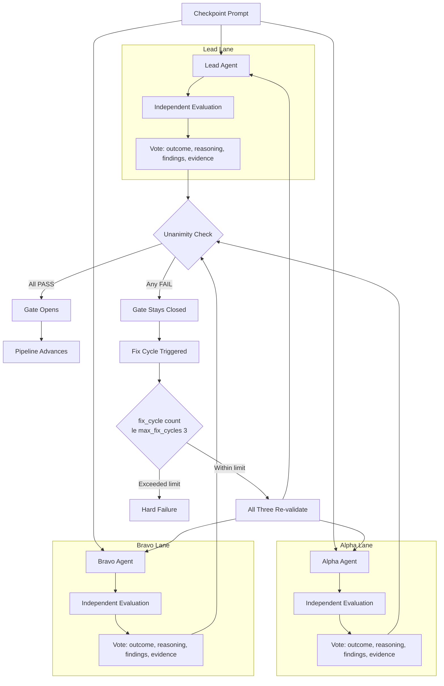

## A Single AI Agent Said "Looks Correct." Three Agents Found the P2 Bug.

A single AI agent reviewed my streaming code and said "looks correct."

Three agents found a P2 bug on line 926. Here is the full story of how a one-character fix exposed a structural flaw in how we review AI-generated code.

---

### The Bug

I was building ILS, a native iOS client for Claude Code. The streaming chat interface was the core feature: messages arrive from Claude's API as Server-Sent Events, tokens flow in real time, the UI renders them progressively. It looked like it worked. Messages appeared. The UI felt responsive. I ran a single-agent code review. The agent scanned `ChatViewModel.swift`, noted some minor style inconsistencies, and reported: "Streaming implementation looks correct."

The bug had been in the codebase for three days.

Here is what was actually happening. When a user sent a message and Claude's response streamed back, every token appeared twice. The word "Four" rendered as "Four.Four." on screen. The assistant message handler was using `+=` to append text blocks, but those text blocks already contained the full accumulated content from prior `textDelta` streaming events. Append plus authoritative full text equals duplication.

The code looked like this:

```swift
// ChatViewModel.swift, line 926 -- the bug
message.text += textBlock.text
```

The fix:

```swift
// The correct version -- assignment, not append
message.text = textBlock.text
```

One character. The `+=` became `=`. The `+=` operator makes perfect sense if you are building text incrementally from deltas. The `textBlock.text` containing the full accumulated content makes perfect sense if the assistant event is authoritative. Both are valid patterns. The bug exists only at their intersection -- two update mechanisms, each individually reasonable, interacting badly when combined.

But there was a second root cause that compounded the first. The stream-end handler reset `lastProcessedMessageIndex` to zero. On the next observation cycle, the entire SSE message buffer replayed from the beginning, feeding already-processed messages back through the rendering pipeline. Double processing on top of double accumulation.

```swift
// Root cause 2 -- the index reset
// BEFORE (bug):
self.lastProcessedMessageIndex = 0   // replays all messages next cycle

// AFTER (fix):
let finalCount = sseClient.messages.count
self.lastProcessedMessageIndex = finalCount  // preserves position
```

The result in practice: every streaming response stuttered visibly. Tokens appeared, doubled, then resolved to the correct text once streaming completed. It would not crash. It would not fail silently. It would just look broken -- the kind of bug that erodes trust in a product the first time a user sees it.

---

### Why Single-Agent Review Missed It

When you ask one AI agent to review code, it brings a single perspective. It pattern-matches against known error categories. It reads the streaming implementation and sees the shape of correctness -- delta events, accumulation buffers, state updates. Each line makes sense in isolation.

The mistake is that the agent is checking "does this line look correct?" when the bug is about how two correct-looking lines interact. The `+=` operator is a standard accumulation pattern. The `textBlock` containing full text is a standard authoritative-update pattern. The individual reviewer sees both patterns, recognizes both as valid, and moves on. The bug lives in the space between the patterns.

This is not unique to AI. Human code review has the same failure mode. Individual reviewers develop blind spots. The pattern recognition that makes you productive is exactly what causes you to miss novel bugs. You see what you expect to see.

---

### The Three-Agent Architecture

Multi-agent consensus addresses this structurally. Not by making each agent smarter, but by ensuring that genuinely independent perspectives must all agree before work advances.

The pattern: three agents review independently. All three must vote PASS. Any single FAIL keeps the gate closed.

I built this as a Python CLI framework. The three roles are defined as frozen dataclasses in `roles.py`, each with a specialized system prompt, focus areas, and a list of what it is calibrated to catch:

```python
LEAD = RoleDefinition(
    role=Role.LEAD,
    title="Lead (Architecture & Consistency Specialist)",
    focus_areas=[
        "Cross-component consistency",
        "API contract compliance",
        "Pattern adherence",
        "Architectural coherence",
        "Regression detection",
    ],
    catches=[
        "Contract mismatches between layers",
        "Pattern violations",
        "Inconsistent naming or data shapes",
        "Fixes that break other components",
    ],
)
```

Lead validates the whole. It looks for cross-component consistency, whether all parts agree on contracts and naming, whether fixes introduced new inconsistencies elsewhere. In the ILS case, Lead cross-checked that both the SDK and CLI execution paths used the same corrected handler after the fix was applied.

```python
ALPHA = RoleDefinition(
    role=Role.ALPHA,
    title="Alpha (Code & Logic Specialist)",
    focus_areas=[
        "Line-by-line code correctness",
        "State management and accumulation patterns",
        "Operator correctness (+= vs = vs ==)",
        "Off-by-one and boundary errors",
        "API contract compliance",
    ],
    catches=[
        "Logic errors invisible in isolation",
        "Incorrect accumulation (the += bug)",
        "State machine index resets",
        "Race conditions in async code",
    ],
)
```

Alpha is the detail-oriented auditor. It reads implementation line by line. Its system prompt includes what I call "THE += vs = PRINCIPLE" -- a direct reference to this exact bug class, embedded as institutional knowledge:

> "The most dangerous bugs look correct in isolation. `message.text += delta` makes sense for incremental accumulation. `delta` containing full accumulated text makes sense for authoritative updates. The bug exists at their INTERSECTION. Look for these interactions."

Alpha caught both root causes in the ILS streaming bug on the first pass because it was specifically prompted to look at how data flow mechanisms interact -- not just whether individual lines were correct.

```python
BRAVO = RoleDefinition(
    role=Role.BRAVO,
    title="Bravo (Systems & Functional Specialist)",
    focus_areas=[
        "Functional correctness under real conditions",
        "Edge case behavior",
        "UI/output verification",
        "Performance under load",
        "Regression detection",
    ],
    catches=[
        "Bugs that only appear at runtime",
        "Visual/output duplication or corruption",
        "Edge cases with real data",
        "Regressions in existing flows",
    ],
)
```

Bravo exercises the running system. Its prompt explicitly states: "Alpha reads code. You RUN things." Bravo confirmed the fix by verifying that responses rendered as "Four." and "Six." -- not "Four.Four." and "Six.Six."

The three roles are not arbitrary. They are calibrated so that what Alpha misses in the running UI, Bravo catches, and what both miss at the architectural level, Lead finds.

---

### How the Gate Actually Works

The gate mechanism is implemented in `gate.py`. Each agent is invoked via subprocess -- the Claude CLI with `--print`, a model flag, and the role-specific system prompt:

```python
cmd = [
    "claude", "--print",
    "--model", agent_config.model,
    "--system-prompt", system_prompt,
    user_prompt,
]

result = subprocess.run(
    cmd,
    capture_output=True,
    text=True,
    timeout=agent_config.timeout_seconds,
)
```

By default, agents run in parallel using `ThreadPoolExecutor` with `max_workers=3` -- true independence, no shared state, no ability to anchor on each other's conclusions:

```python
with ThreadPoolExecutor(max_workers=3) as executor:
    future_to_role = {
        executor.submit(
            run_agent_validation, role_def, phase_name, target_path, config,
        ): role_def
        for role_def in roles
    }
```

Each agent returns a structured JSON vote. The framework parses it into a Pydantic model:

```python
class Vote(BaseModel):
    role: Role
    outcome: VoteOutcome       # PASS or FAIL
    reasoning: str             # 2-3 sentence summary
    findings: list[str]        # specific issues found
    evidence_paths: list[str]  # file paths, line numbers, command output
    duration_seconds: float
```

Unanimity is computed with a single line:

```python
unanimous = all(v.is_pass() for v in votes)
```

If any agent's JSON response fails to parse, the framework defaults to FAIL for safety -- not PASS. Ambiguity blocks the gate:

```python
except json.JSONDecodeError as e:
    return Vote(
        role=role,
        outcome=VoteOutcome.FAIL,
        reasoning=f"Vote response parsing failed: {e}",
        findings=["Agent response was not valid JSON -- treating as FAIL for safety"],
    )
```

The `GateResult` model aggregates everything:

```python
class GateResult(BaseModel):
    phase_name: str
    gate_number: int
    votes: list[Vote]
    unanimous_pass: bool
    evidence: list[Evidence]
    fix_cycle_count: int
```



---

### The Fix Cycle: Why All Three Re-Validate

When a gate fails, the fix-and-retry loop is where the pattern earns its overhead cost. The critical design decision: after a fix is applied, ALL THREE agents re-validate, not just the one that failed.

```python
def run_gate_with_fix_cycles(..., max_fix_cycles=3, fix_callback=None):
    for cycle in range(max_fix_cycles + 1):
        result = run_gate_check(...)
        if result.unanimous_pass:
            return result
        # Apply fixes, then re-validate with ALL THREE agents
        findings = result.all_findings()
        fix_callback(findings)
```

This catches the failure mode where a fix resolves the original issue but introduces a regression. The agent that previously passed might now fail on something the fix broke. You do not get to carry forward stale passing votes.

In the ILS streaming fix, after Alpha flagged the `+=` bug and the index reset, the fix was implemented. Then all three re-ran. Alpha confirmed the code logic was correct (assignment, not append; index preserved). Bravo ran the app and verified clean single-token rendering. Lead cross-checked that both SDK and CLI execution paths used the same corrected handler. All three PASS. Gate opened.

---

### The Cost and When It Is Worth It

The default configuration in `config.py` assigns models by role: Lead runs on Opus (deepest reasoning for architectural analysis), while Alpha and Bravo run on Sonnet (best coding model for detail work):

```python
lead: AgentConfig = field(default_factory=lambda: AgentConfig(model="opus"))
alpha: AgentConfig = field(default_factory=lambda: AgentConfig(model="sonnet"))
bravo: AgentConfig = field(default_factory=lambda: AgentConfig(model="sonnet"))
```

The pipeline defaults to four phases -- explore, audit, fix, verify -- with a maximum of 3 fix cycles per gate before hard failure. Running three agents in parallel (`parallel_agents: true` by default) means you pay 3x in compute but roughly 1x in wall clock time.

I have run this pattern across 3 projects with 10 blocking gates each. The cost per gate averages roughly $0.15. For the ILS streaming bug specifically, the consensus pass that caught it cost minutes and cents. The alternative -- a P2 visual duplication bug in a live product's core chat interface -- would have required a hotfix release and weeks of trust repair.

Use three-agent consensus when complex state management has multiple interacting update mechanisms, when multiple system layers must agree on data contracts, when a bug would be immediately visible to users, or when you are running comprehensive audits across 50+ files. Stick with single-agent review for isolated, low-risk changes where speed matters more than thoroughness.


---

### The Broader Principle

What makes this work is not the number three. It is two structural properties: independent verification and hard gates.

Independent verification means each agent starts from scratch with no anchor on another agent's conclusions. This is the AI equivalent of not showing one code reviewer another reviewer's comments before they have formed their own opinion. It eliminates groupthink.

Hard gates mean that "mostly passing" is not passing. Two-out-of-three does not open the gate. The unanimity requirement, implemented as `all(v.is_pass() for v in votes)`, eliminates the reviewer who waves something through because someone else already approved it.

The `+=` operator was right there on line 926 for three days. It looked correct because the pattern -- accumulate text in a streaming handler -- should use append. The bug was that this particular text was already accumulated. A single perspective saw what it expected. Three independent perspectives, forced to agree, found what one would have shipped.

Full framework with CLI, Pydantic models, and pipeline orchestrator: [github.com/krzemienski/multi-agent-consensus](https://github.com/krzemienski/multi-agent-consensus)

Technical writeup with system diagrams: [github.com/krzemienski/agentic-development-guide/tree/main/04-multi-agent-consensus](https://github.com/krzemienski/agentic-development-guide/tree/main/04-multi-agent-consensus)

#CodeQuality #AI #SoftwareEngineering #CodeReview #AgenticDevelopment

---

*Part 2 of 11 in the [Agentic Development](https://github.com/krzemienski/agentic-development-guide) series.*
